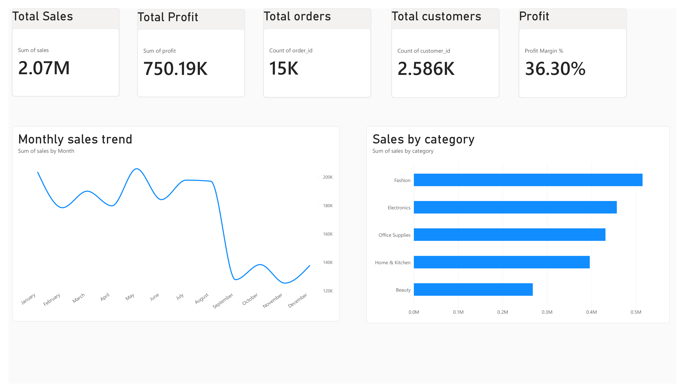
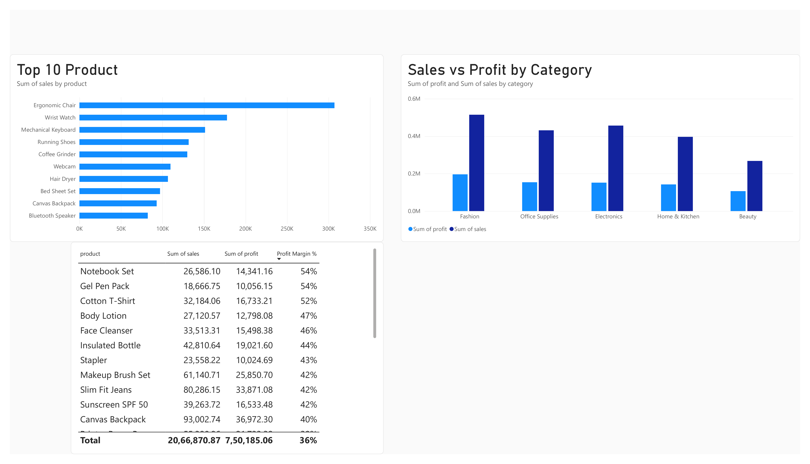
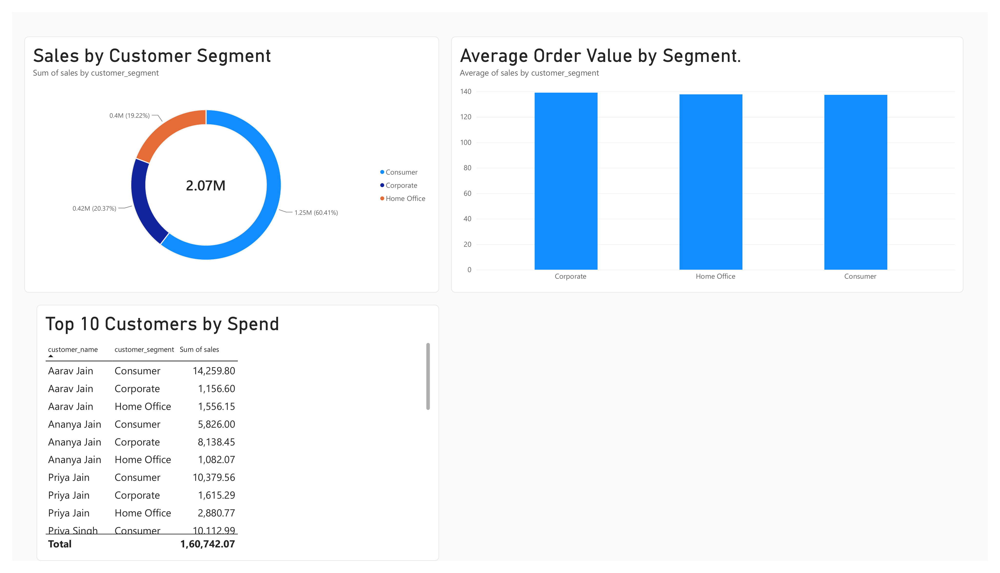
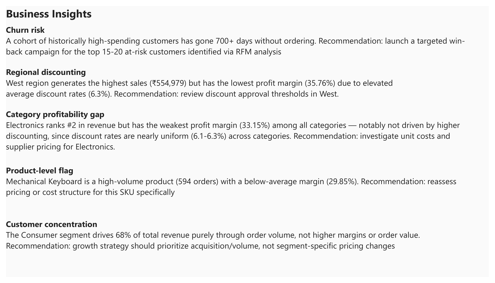

# E-Commerce Sales Analytics

An end-to-end data analysis project covering data cleaning, SQL business analysis, and dashboarding on a 15,000-row e-commerce sales dataset. This project demonstrates the ability to take raw, messy data through to clean data, business insight, and executive-ready visualization.

**Tools used:** Excel · MySQL · Power BI

---

## Business Problem

An e-commerce company wants to understand where its sales and profit are coming from, which regions and categories carry hidden profitability risk, and which customers are worth prioritizing for retention — using 15,000 transaction records across regions, product categories, and customer segments.

## Business Questions Answered

1. What are the monthly sales, profit, and order volume trends?
2. Which regions have high sales but low profit margin?
3. What's the month-over-month growth rate in revenue?
4. Which categories generate the most revenue vs. the most profit?
5. Are there specific products with high sales volume but poor profit margins?
6. What's the average discount rate by category, and does it correlate with lower margins?
7. Which customer segments contribute the most revenue?
8. What's the average order value by segment?
9. Which high-spending customers haven't ordered recently? (churn risk)
10. What's the order fulfillment rate by payment method and source channel?
11. Which regions have the highest cancellation/return rate?

---

## 1. Data Cleaning (Excel)

Started with a messy 15,180-row, 22-column dataset containing inconsistent text casing, duplicate order records, missing values, and three coexisting date formats.

**What was done:**
- Standardised text casing across categorical fields using `TRIM` and `PROPER`
- Removed 180 duplicate Order IDs
- Reconstructed 101 missing discount rates from `Discount Amount ÷ Gross Sales`
- Filled missing categorical values (Customer Name, City, Payment Method, Source Channel) with `"Unknown"`
- Resolved three coexisting date formats (ISO, US slash, day-month-year) using Power Query in Power BI; 180 unparseable rows were excluded and documented

📄 [View the cleaned Excel workbook](./Excel/ecommerce_sales_analysis_portfolio.xlsx)

**Key finding:** West region generates the highest sales (₹554,979) but carries the highest average discount rate (6.3%) — an early signal of a margin problem, later confirmed independently in SQL.

---

## 2. Business Analysis (SQL / MySQL)

Loaded the cleaned dataset into a MySQL database and answered 11 real-world business questions using progressively advanced SQL — aggregation, `GROUP BY`, `HAVING`, `CASE`, `IN`, Common Table Expressions (CTEs), and window functions (`LAG`).

📄 [View all SQL queries](./SQL/) · [Read the full SQL study notes](./SQL/SQL_Study_Notes.md)

**Key findings:**
- West region: highest sales, lowest profit margin (35.76%) — confirms the Excel finding independently
- Electronics ranks #2 in revenue but has the weakest profit margin (33.15%) — and it's **not** driven by discounting, since discount rates are nearly uniform (6.1%–6.3%) across all categories. The real driver is likely unit cost, not promotions.
- Mechanical Keyboard: a high-volume product (594 orders) with a below-average margin (29.85%) — flagged for pricing review
- Consumer segment drives 68% of revenue purely through order volume, not higher margins or order value
- A cohort of historically high-spending customers has gone 700+ days without ordering — a clear churn-risk list for a win-back campaign
- Order fulfillment and cancellation/return rates are consistent across all payment methods, channels, and regions — no single operational weak point

---

## 3. Dashboard (Power BI)

Built a 4-page interactive dashboard connecting directly to the MySQL database, translating the SQL findings into an executive-ready visual report.

📄 [Download the Power BI file](./PowerBI/) · [View dashboard screenshots](./Images/)

**Pages:**
1. **Executive Overview** — KPIs (Total Sales, Profit, Orders, Customers, Profit Margin), monthly sales trend, sales by category
2. **Product Analysis** — Top 10 products by revenue, sales vs. profit by category, full product profitability table
3. **Customer Analysis** — Sales by customer segment, average order value by segment, top 10 customers by spend
4. **Business Insights** — Plain-language findings and recommendations for stakeholders

### Executive Overview


### Product Analysis


### Customer Analysis


### Business Insights


---

## Key Business Recommendations

| Finding | Recommendation |
|---|---|
| West region: high sales, low margin (discount-driven) | Review discount approval thresholds specifically for West |
| Electronics: weak margin, not discount-driven | Investigate unit costs and supplier pricing for Electronics |
| Mechanical Keyboard: high volume, low margin | Reassess pricing or cost structure for this specific SKU |
| Consumer segment drives revenue via volume, not value | Prioritize acquisition/volume growth over segment-specific pricing |
| High-value customers going inactive (700+ days) | Launch a targeted win-back campaign for top at-risk customers |

---

## Limitations

- 180 rows (1.2%) were excluded due to unparseable dates during cleaning
- Discount rates for 101 rows are reconstructed estimates, not original values
- The dataset is synthetic; findings illustrate methodology and analytical process rather than real market behavior
- Customer count differs slightly between an early Excel RFM sample (256) and the final complete dataset (2,586 unique customers, confirmed via SQL) — the SQL/Power BI figure is authoritative
- One row in the Power BI "Top 10 Customers" view displays a caching-related label mismatch despite clean underlying SQL data — verified via direct query, not a data quality issue

---

## Repository Structure

```
ecommerce-sales-analytics/
│
├── Data/               → Cleaned dataset (CSV)
├── Excel/              → Cleaned Excel workbook with RFM analysis and pivot tables
├── SQL/                → Business analysis queries + SQL study notes
├── PowerBI/             → Interactive dashboard (.pbix)
├── Images/              → Dashboard screenshots
└── README.md
```

## Tech Stack

- **Excel** — data cleaning, pivot tables, RFM segmentation
- **MySQL** — database design, data loading, business query analysis
- **Power BI** — data modeling, DAX measures, interactive dashboarding
